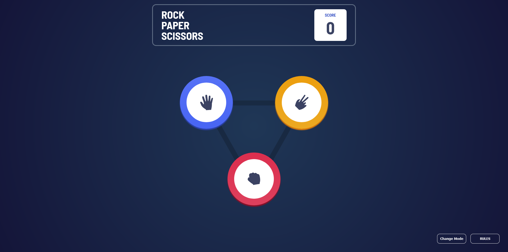

# Frontend Mentor - Rock, Paper, Scissors solution

This is a solution to the [Rock, Paper, Scissors challenge on Frontend Mentor](https://www.frontendmentor.io/challenges/rock-paper-scissors-game-pTgwgvgH). Frontend Mentor challenges help you improve your coding skills by building realistic projects. 

## Table of contents

- [Overview](#overview)
  - [The challenge](#the-challenge)
  - [Screenshot](#screenshot)
  - [Links](#links)
- [My process](#my-process)
  - [Built with](#built-with)
  - [What I learned](#what-i-learned)
  - [Continued development](#continued-development)
  - [Useful resources](#useful-resources)
- [Author](#author)
- [Acknowledgments](#acknowledgments)

**Note: Delete this note and update the table of contents based on what sections you keep.**

## Overview

### The challenge

Users should be able to:

- ✔️ View the optimal layout for the game depending on their device's screen size
- ✔️ Play Rock, Paper, Scissors against the computer
- ✔️ Maintain the state of the score after refreshing the browser _(optional)_
- ✔️ **Bonus**: Play Rock, Paper, Scissors, Lizard, Spock against the computer _(optional)_

### Screenshot

### Links

- Solution URL: [Add solution URL here](https://your-solution-url.com)
- Live Site URL: [Add live site URL here](https://your-live-site-url.com)

## My process

- I had to manually set a positioning for each choice, resulting in multiple spaghetti code in the CSS. Took me a long time to figure out I had to it this way, but very easy to implemenet. 

### Built with

- Semantic HTML5 markup
- CSS custom properties
- Flexbox
- Mobile-first workflow

### What I learned

- The <template> can really be handy. The CSS styling was harder than the whole JavaScript, though I took a lot more time coding in JavaScript. 

### Continued development

- I added my own twist of animations, though it's a bit clunky. Hopefully, it can be buttersmooth in the future.

### Useful resources

- [Pulse Animation](https://www.youtube.com/watch?v=Qtggx2rswKY&) - This pulse animation came in quite handy. A very good solution to a feature that I cannot begin to think of an approach.

- [Asaeneh's 30 Day of JavaScript](https://github.com/Asabeneh/30-Days-Of-JavaScript) - Asaeneh's guide to JavaScript. 

## Author

- [Github](https://github.com/Justinjovert/)
- Frontend Mentor - [Justinjovert](https://www.frontendmentor.io/profile/Justinjovert)

## Acknowledgments

Frontend Mentor, Asabeneh Yetayeh and Codehal's pulse animation
